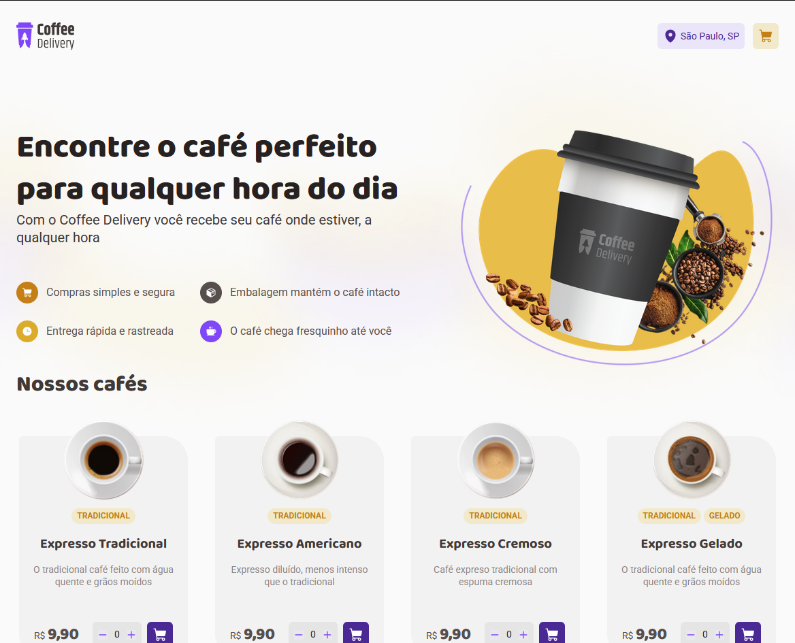
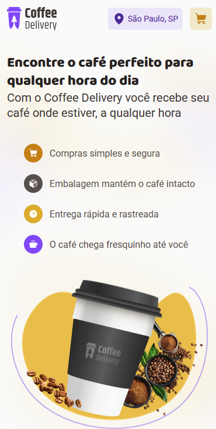
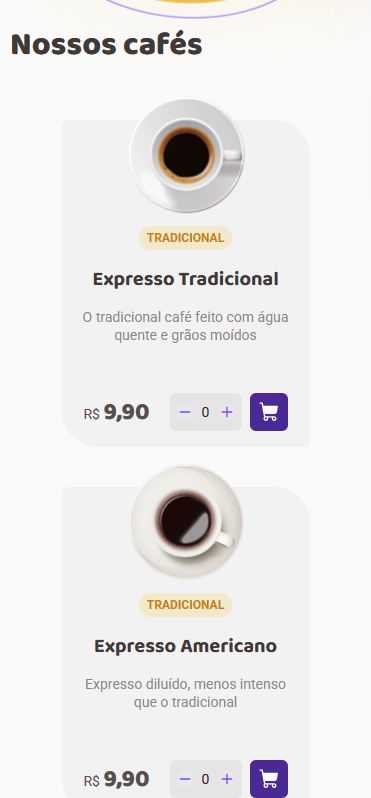
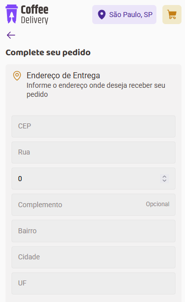
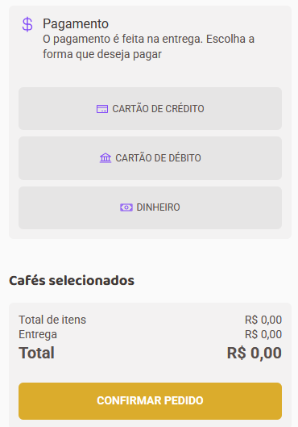

# Desafio: Ignite Coffee Delivery ☕

Essa aplicação foi criada seguindo as diretrizes do desafio "Coffee Delivery"
do curso de React da Rocketseat.

O desafio apresenta um layout no Figma para servir de guia e o desenvolvedor
deve segui-lo para construir a aplicação.

## Sobre o desafio 📋

Nesse desafio, você vai desenvolver uma aplicação para gerenciar um carrinho 
de compras de uma cafeteria fictícia, que contém as seguintes funcionalidades:

- Listagem de produtos (cafés) disponíveis para compra
- Adicionar uma quantidade específicas de itens no carrinho
- Aumentar ou remover a quantidade de itens no carrinho
- Formulário para o usuário preencher o seu endereço
- Exibir o total de itens no carrinho no Header
- Exibir o valor total da soma de itens no carrinho multiplicados pelo valor

A aplicação exige do desenvolvedor:

- Estados
- ContextAPI
- LocalStorage
- Imutabilidade do estado
- Listas e chaves no ReactJS
- Propriedades
- Componentização

## O que acrescentei ao projeto ➕

- Layout `Responsivo` utilizando Mobile First Development
- `Geolocalização` com a API da [Nominatim](https://nominatim.org/release-docs/latest/api/Reverse/)
- Busca automática de endereço através da API [`VIACEP`](https://viacep.com.br/)
- Funcionalidade de voltar para a Home ao entrar na página Checkout

<table style="max-width: 800px; margin: 0 auto;">
  <tr>
    <td style="vertical-align: top; padding: 5px 10px;"></td>
    <td style="vertical-align: top; padding: 5px 10px;"></td>
    <td style="vertical-align: top; padding: 5px 10px;"></td>
    <td style="vertical-align: top; padding: 5px 10px;"></td>
  </tr>
</table>
